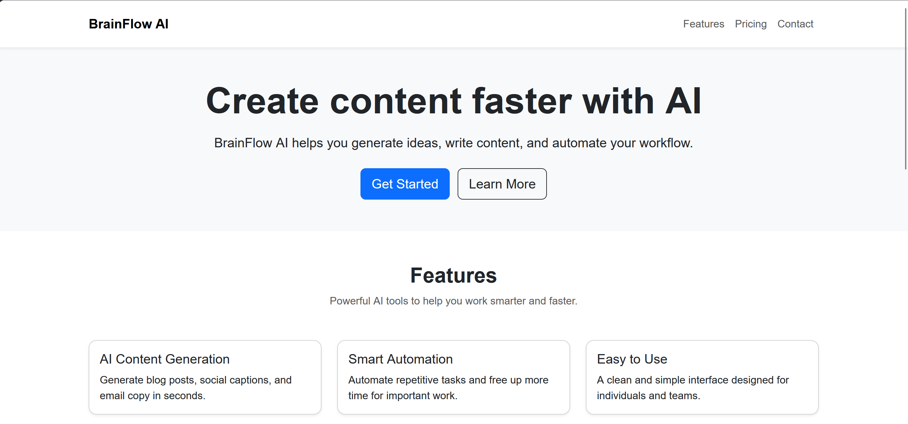
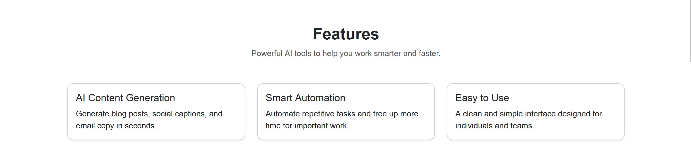
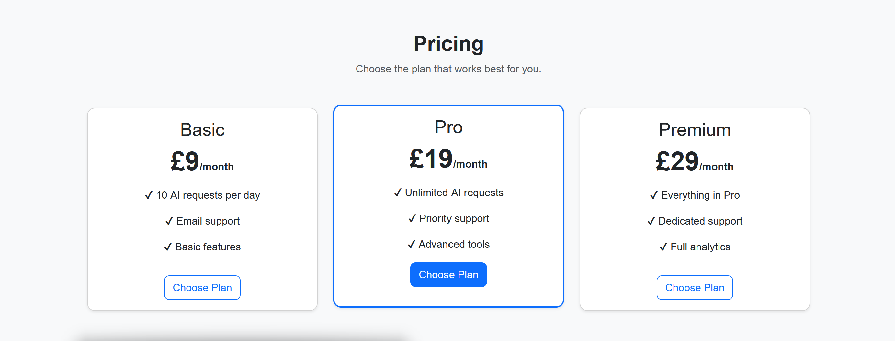

# BrainFlow AI – Bootstrap SaaS Landing Page

A responsive marketing landing page built with Bootstrap for a fictional AI SaaS product called **BrainFlow AI**.
The project demonstrates modern UI layout, responsive design, and the use of Bootstrap’s grid system and components.

---

## Features

* Responsive navigation bar
* Hero section with call-to-action
* Features section using Bootstrap cards
* Pricing section with subscription plans
* Call-to-action section
* Footer with links
* Smooth scrolling navigation
* Hover effects for interactive UI

---

## Bootstrap Concepts Demonstrated

* **Grid System** – Responsive layout using rows and columns
* **Breakpoints** – Mobile-first design (`col-12`, `col-md-6`, `col-lg-4`)
* **Components** – Navbar, cards, buttons
* **Utility Classes** – Spacing, alignment, colors
* **Responsive Design** – Works across mobile, tablet, and desktop

---

## Tech Stack

* HTML
* CSS
* Bootstrap 5

---

## How to Run

1. Clone the repository:

```bash
git clone https://github.com/HReid17/bootstrap-saas-landing-page.git
```

2. Open the project folder

3. Open `index.html` in your browser
   *(or use Live Server in VS Code)*

---

## Project Structure

```bash
bootstrap-saas-landing-page/
│── index.html
│── style.css
│── README.md
│── screenshots/
```

---

## Screenshots

### Home View



---

### Features Section



---

### Pricing Section



---

## Key Learning

This project helped reinforce my understanding of how Bootstrap simplifies building responsive layouts and UI components, as well as how to structure a real-world SaaS landing page.

---

## Future Improvements

* Add animations for sections on scroll
* Improve accessibility (ARIA labels, contrast)
* Add a contact form
* Deploy the project with a live demo

---
